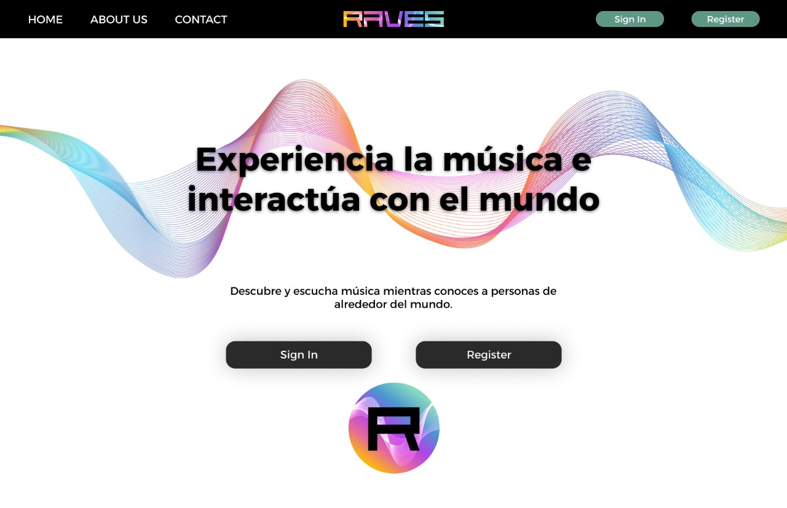

# Raves: Plataforma Musical y Social

**Raves** es una plataforma innovadora que combina la música y la interacción social, permitiendo a los usuarios conectarse y compartir su pasión musical de formas únicas. A través de sesiones en vivo, perfiles personalizados y herramientas de descubrimiento, Raves crea un espacio donde los amantes de la música pueden explorar nuevos sonidos, encontrar personas con gustos similares y vivir experiencias musicales compartidas a nivel global. 

Es más que una simple aplicación de música; es un lugar donde la música une a las personas y fomenta conexiones significativas.

---

## 🚀 **Características Principales**

- **Sincronización de ondas musicales**: Permite a los usuarios crear sesiones en vivo donde varias personas pueden escuchar la misma música en tiempo real.
- **Creación de Perfiles**: Cada usuario tiene un perfil que refleja sus géneros musicales favoritos y listas de reproducción personalizadas. Estos pueden ser compartidos y comparados con otros para encontrar afinidades musicales.
- **Explorador de Conexiones**: Utiliza algoritmos para sugerir usuarios, comunidades, canciones, playlists, artista y álbumes.
- **Mapa Musical**: Ofrece la posibilidad de explorar música geolocalizada en tiempo real, conectando a los usuarios con escenas musicales locales y globales, y facilitando el descubrimiento de música popular o emergente en diferentes regiones.
- **Comunidades**: Los usuarios pueden unirse a comunidades basadas en géneros musicales, artistas específicos o temas de interés musical, en las cuales se puede publicar y comentar sobre temas relacionados.
- **Biblioteca**: Una manera fácil de gestionar las playlists, álbumes y artistas seguidos por el usuario.
- **Chats**: Permite a los usuarios comunicarse entre ellos, mostrando el listado de chats para cada amigo que se posee.

---

## 👩‍💻 **Autores del Proyecto**

Este proyecto fue desarrollado por un equipo de apasionados por la música y la tecnología:

- **Marcelo Binda**
- **Ainhoa Castillo**
- **Cassius Martel**
- **Tomio Nakamurakare**
- **Angie Yalán**

---

## 🎯 **Segmentos Objetivo**

Para llegar de manera eficiente a futuros clientes y ofrecer un producto que verdaderamente satisfaga sus necesidades, hemos identificado los siguientes tres **segmentos objetivo**:

### Segmento objetivo #1: **Usuarios interesados en formar amistades**
Aquellas personas que desean conocer gente nueva, basándose en preferencias musicales similares.

### Segmento objetivo #2: **Usuarios que comparten música con su entorno**
Aquellas personas que desean escuchar música con amistades en sesiones en vivo y que desean crear una conexión más profunda a través de la música.

### Segmento objetivo #3: **Usuarios en búsqueda de música nueva**
Aquellas personas que desean conocer nuevos géneros musicales y artistas de alrededor del mundo, expandiendo sus horizontes musicales.

---

## 📱 **Landing Page de Raves**

---

## 📄 **Licencia**

Este proyecto ha sido licenciado bajo el equipo de Echo.

---

Gracias por visitar el proyecto **Raves**. ¡Esperamos que disfrutes de la música!
